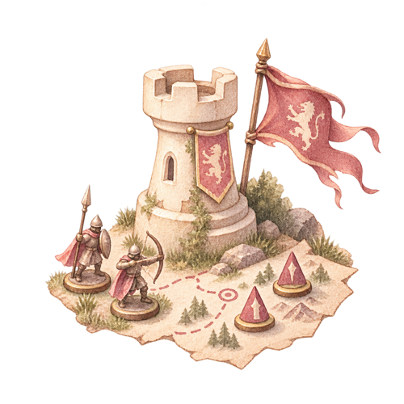

<div align="center">

# 🐱 小懵 · AI 桌游主持人

### 一个人也能开局，一群人也能开黑

不用自己啃规则书、不用有人专门当"苦力主持人"——告诉小懵你想玩什么桌游，它按你选的主持方式带你摆盘、讲规则、走流程、记分、结算，从第一次摆放到最后算分全程陪你。

**规则讲解 📖 · 逐回合主持 🎲 · 语音对话 🎙️ · 多人在线同桌 🔗 · 隐藏身份发牌 🎭**

<br/>


-orange?style=flat-square&logo=firebase&logoColor=white)


<br/>

`无需构建工具`　·　`打开即用`　·　`API Key 只留在你本机`　·　`一个人玩也行`　·　`支持在线邀请好友`

</div>

---

## 它解决什么

想开一局没人玩过的新桌游，通常卡在这几件事上：

- 说明书太长，没人愿意先啃完再讲给大家听
- 摆放/setup 经常摆错，第一局体验就被劝退
- 中途有规则争议，没人能当场说清楚
- 隐藏身份类游戏（阿瓦隆、狼人杀……）需要一个不参与游戏、只负责保密发牌的主持人，但人凑不齐

小懵就是那个"专门啃规则书 + 主持流程 + 保守秘密"的角色：

> **"我们想玩阿瓦隆，我是新手。"**

它做：**识别游戏 → 30 秒讲清楚怎么赢 → 指导摆放 → 开局教学 → 每回合提醒该做什么 → 私下给每个人发身份 → 答疑 → 记分 → 结算**。

你只需要说话（或者直接开语音），不用自己翻规则书。

---

## 🗺️ 按类型找游戏

首页是一张手绘风格的地图，每个图钉对应一类桌游打法，点进去看每类的代表作、玩家人数和时长参考。

<p align="center">
  
  
  
  
  
  
</p>

<p align="center"><sub>美式桌游 · 德式桌游 · 毛线桌游 · 跑团 · 战棋 · TCG（集换式卡牌）</sub></p>

---

## ✨ 核心能力

**🎭 四种主持方式，按需切换**

| 方式 | 适合 | 小懵负责什么 |
|---|---|---|
| 🎙️ AI 全程主持 | 阿瓦隆、三国杀、谁是卧底、狼人杀 | 记住谁是卧底、谁的牌面朝下，按流程逐步公布结果，不提前泄密 |
| ♟️ 玩家自主策略 | 卡坦岛、璀璨宝石、大富翁 | 讲清规则和摆放，策略决策交给玩家自己 |
| 🎉 派对团队 | 你画我猜、猜歌达人 | 出题、计时、判分，不冷场 |
| 📖 合作叙事 | 瘟疫危机、简化版跑团 | 讲述剧情、扮演 NPC，和所有人一起达成目标 |

**🔗 多人在线同桌，一台设备管到底**

开局时勾选"创建在线房间"，生成房间码 + 二维码，好友用自己的手机扫码加入、各自打字或说话聊天。只有房主的设备存着 API Key——所有人的消息经房主中转给模型，AI 的回复再同步给每个人的手机，Firestore 没配置时自动退回本机模式，不影响单人使用。

**🎭 隐藏身份，真的保密**

阿瓦隆、血染钟楼这类游戏，AI 会通过私聊（每个玩家单独一份 Firestore 文档）把身份牌发给对应的人，不会出现在大家都能看到的公共聊天里。房主自己也有一个"🎭 我的身份"按钮，能看到自己的秘密身份而不用大喊出来。

**🎙️ 真正的语音对话，不是按键说话**

打开"智能语音对话"后不用一直按着麦克风——它会自动判断你说完了（静音检测），自动发送，AI 回复完读完语音后自动继续听，跟人对话一样。默认用浏览器自带的语音识别/朗读（仅 Chrome / Edge 支持语音输入）；也可以在设置里填一个语音 API Key（默认对接 OpenAI 格式的 `/v1/audio/transcriptions`、`/v1/audio/speech`），这样所有浏览器都能用语音功能，不只是 Chrome。

**🐱 可以给它改名**

默认叫"小懵"，在设置里可以改成任何你喜欢的名字，聊天界面、系统提示词里的自称都会跟着变。

**✦ 帮我推荐，真的连着数据库**

首页填一下人数/时长/想要的感觉，会在内置的桌游库里现场打分排序出结果（不用等模型响应），命中原因会标出来（比如"人数符合""烧脑硬核"）。数据库没收录的游戏，一键"问问 AI"直接交给模型回答。

---

## 🚀 3 步开始

```bash
# 1. 拉代码
git clone https://github.com/Jing0712/boardgaming-agent.git
cd boardgaming-agent

# 2. 直接用浏览器打开
open index.html
```

打开后：

1. 点右上角 ⚙，填入你的[火山方舟（Volcengine Ark）](https://console.volcengine.com/ark) API Key 和推理接入点 ID
2. 保存后即可开始对话——告诉小懵你想玩什么桌游
3. 想邀请朋友在线同玩？创建新对局时勾选"创建在线房间"（需要先配置 Firebase，见下方"进阶配置"）

---

## ⚙️ 配置一览

| 功能 | 必填程度 | 配置项 | 不配置会怎样 |
|---|---|---|---|
| 🧠 AI 主持对话 | **必填** | 火山方舟 API Key + 推理接入点 ID | 无法开始对话 |
| 🎙️ 语音对话 | 选填 | 设置里的"语音 API Key"（OpenAI 格式） | 退回浏览器自带语音（仅 Chrome/Edge 支持语音输入，朗读全浏览器可用） |
| 🔗 多人在线房间 | 选填 | `index.html` 顶部 `firebaseConfig`（免费 Firebase 项目） | 邀请链接只在房主本机有效，退回本机单人模式 |

所有 Key 都只保存在浏览器本地（`localStorage`，勾选"记住这台设备"才会持久化），直接从你的浏览器发到对应服务商，不经过任何中间服务器。

---

## 📦 项目结构

```txt
.
├── index.html          # 主应用（单文件，包含全部逻辑与样式）
├── assets/
│   └── map/             # 首页地图的图钉插画（6 种桌游类型）
│       ├── american.png
│       ├── german.png
│       ├── wool.png
│       ├── trpg.png
│       ├── wargame.png
│       └── tcg.png
└── README.md
```

纯前端、零构建步骤——没有 `package.json`，不需要 `npm install`，浏览器打开 `index.html` 就是完整应用。

---

## ❓ 常见问题

<details>
<summary><b>🔐 保存 Key 之后报 Failed to fetch？</b></summary>

大概率是浏览器直接调用 Volcengine Ark 接口时遇到 CORS（跨域）限制。通常需要搭一个简单的服务端代理转发请求，或确认接入点已经开通了跨域访问的域名白名单。
</details>

<details>
<summary><b>🎤 语音输入按钮是灰的，点不了？</b></summary>

没配置语音 API 的情况下，语音输入依赖浏览器自带的 Web Speech API，目前只有 Chrome / Edge 支持。换个浏览器，或者去设置里填一个语音 API Key 就能在任意浏览器用了。
</details>

<details>
<summary><b>🔗 邀请好友后，对方打不开房间 / 一直卡在"正在创建房间"？</b></summary>

检查 `index.html` 顶部的 `firebaseConfig` 是否已经填好一个真实 Firebase 项目（Firestore Database 需要在控制台里创建）。没配置的话邀请功能只在你自己设备上有效，这是预期行为，不影响你自己单人游玩。
</details>

<details>
<summary><b>🎭 隐藏身份游戏，AI 真的不会把身份说漏嘴吗？</b></summary>

身份分配走的是每个玩家独立的私有 Firestore 文档，不进公共聊天记录。不过目前没有接入身份验证（Firebase Auth），安全性基于"你需要同时知道房间码和自己的名字"，不是硬性的权限隔离——正式场合请知悉这一限制。
</details>

<details>
<summary><b>🔍 搜索/推荐找不到某款游戏？</b></summary>

内置数据库是精选的 106 款代表作，不是完整的桌游库。搜不到的时候页面上会有个"问问 AI"按钮，直接把这个游戏交给模型回答——模型认识的游戏比数据库里多得多。
</details>

<details>
<summary><b>📱 能在手机上用吗？</b></summary>

可以，界面按移动端做了适配。多人对局本来就是设计给"房主开一台、好友各自用手机加入"这个场景用的。
</details>

---

## 🧩 技术说明

- 核心是纯前端实现，无自建后端、无构建步骤，单文件 HTML 承载全部逻辑与样式——单人使用完全不需要任何服务端
- 多人房间是唯一用到云端的部分：接入 Firebase Firestore 作为**托管的**实时数据库（不是我们自己写/部署的服务端，但确实是一个云端服务），房主设备做唯一的 AI 调用中转，其他人的设备只读写 Firestore
- 通过 OpenAI 兼容格式调用 Volcengine Ark 的 `/chat/completions` 接口
- "帮我推荐"和搜索走的是内置的**本地桌游数据库**（106 款代表作，源自 [Kaggle 的 BoardGameGeek 数据集](https://www.kaggle.com/datasets/andrewmvd/board-games) 清洗+精选），按人数/时长/关键词打分排序，全程不需要调用模型；数据库里没有的游戏可以点"问问 AI"，交给模型直接回答
- 角色形象是水彩插画猫，跟着对话状态切换 CSS 动画（呼吸/摆头/预动），无需额外图片资源
- 语音识别/朗读默认使用浏览器 Web Speech API，也可切换到 OpenAI 格式的云端语音接口（`MediaRecorder` 录音 + 静音检测自动分句）
- 系统提示词内置在 `index.html` 的 `SYSTEM_PROMPT` 常量里，可直接编辑调整主持人的语气、格式和行为规则

## 已知限制

- 目前通过浏览器直接调用 Volcengine Ark API，可能会遇到 CORS 限制导致请求失败，详见上方 FAQ
- 隐藏身份的私有信息基于"知道房间码 + 玩家名"的弱隔离，不是强权限校验
- 模型的规则解释仅供参考，正式比赛或有争议场景请以官方规则书为准

## License

未指定（如需开源协议，比如 MIT，欢迎自行添加 LICENSE 文件）

<div align="center">

---

### 🎲 让小懵当主持人，你只管坐下来玩

**如果它帮你省下了啃规则书的时间，给个 ⭐ Star 吧。**

</div>
